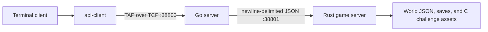

# The Answer Protocol

The Answer Protocol is a multiplayer terminal game built as four cooperating
components:

- `api-client`, a reusable asynchronous Rust client for TAP;
- `tui`, the terminal user interface built with Ratatui;
- `go_server`, the public TAP gateway and session/group server;
- `rust_server`, the game-world, persistence, quest, and combat engine.

## Architecture



Clients only connect to the Go server. The Go server owns public TAP framing,
authentication, chat routing, and groups. It forwards game-world operations to
the Rust server and translates Rust responses and event batches back into TAP
`OK`, `ERR`, and `EVT` frames.

## Documentation

- [TAP commands](TAP_COMMANDS.md) — handshake, requests, responses, payloads,
  and the current support matrix.
- [TAP errors](TAP_ERRORS.md) — every wire error code and symbolic name.
- [TAP events](TAP_EVENTS.md) — every asynchronous server event and payload.
- [Server architecture and internal protocol](server/README.md) — the current
  Go-to-Rust JSON contract.
- [Clients](client/README.md) — the `api-client` library and the TUI.

The server documentation links to dedicated guides for the Go and Rust
implementations.

## Requirements

- Go 1.18 or newer;
- a Rust toolchain with Cargo and Rust 2024 edition support;
- Linux for the Rust fight sandbox;
- `/usr/bin/clang` and `/usr/bin/bwrap` for C challenge evaluation;
- `cargo-clippy` and `rustfmt` for the lint targets.

## Quick start

Install or verify the required tools and fetch locked dependencies:

```bash
make install
```

Build the active components:

```bash
make build-go-server build-rust-server build-client-tui
```

Start both servers in the background and the TUI in the foreground:

```bash
make run
```

This launch path currently starts the TUI from `client`, while its manifest is
resolved relative to `client/tui`. The game remains usable, but cosmetic names
and images fall back to empty data. Run the TUI from `client/tui` as described
in the client guide when those assets are needed.

Pass TUI or Go server arguments through Make variables when needed:

```bash
make run \
  CLIENT_ARGS="--ip 127.0.0.1 --port 38800" \
  GO_SERVER_ARGS="--rust-server-ip 127.0.0.1 --rust-server-port 38801"
```

After leaving the TUI, stop background servers with:

```bash
make stop
```

Runtime logs and PID files created by `make run` are stored under
`/tmp/the_answer_protocol-<uid>` by default. Set `RUN_DIR` to override that
directory.

## Make targets

| Target | Purpose |
| --- | --- |
| `make run` | Build and run both servers and the TUI. |
| `make stop` | Stop servers started by `make run`. |
| `make build-go-server` | Build the Go TAP server. |
| `make build-rust-server` | Build the Rust game server. |
| `make build-client-tui` | Build the TUI and its `api-client` dependency. |
| `make lint` | Run Go vet/format checks and Rust Clippy/rustfmt checks. |
| `make clean` | Remove Go and Cargo build artifacts. |

The generic `make build` target still includes the legacy
`build-client-gui` target. No `client/gui` crate exists in the current
workspace, so use the three active component targets shown above.

## Repository layout

```text
.
├── TAP_COMMANDS.md
├── TAP_ERRORS.md
├── TAP_EVENTS.md
├── client/
│   ├── api-client/
│   ├── tui/
│   └── assets/
└── server/
    ├── go_server/
    └── rust_server/
```

## Verification

```bash
(cd server/go_server && go test ./...)
(cd server/rust_server && cargo test)
(cd client && cargo test --workspace)
```

The current crates and Go packages compile through these test commands, but the
repository does not yet contain behavioral unit or integration tests.
