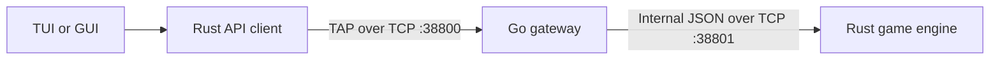
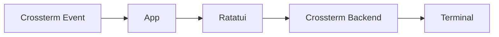
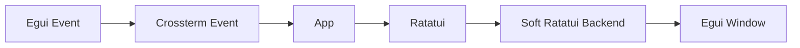
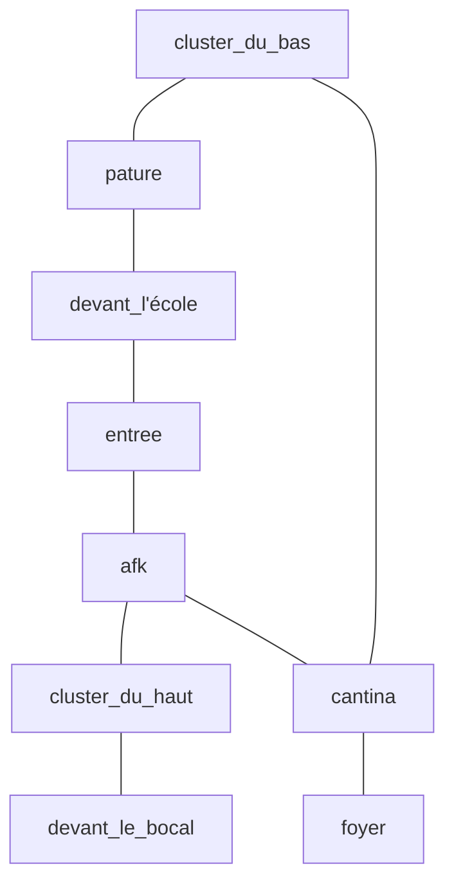

_This project has been created as part of the 42 curriculum by cobussie, nlallema and ldecavel._

## Description

The Answer Protocol is a multiplayer text adventure inspired
by 1970s MUDs. It recreates our school, with our friends as
NPCs you can fight by completing sandboxed C coding challenges.

The project implements RFC [42TAP](PROTOCOL.md) as a line-oriented TCP protocol. The public
[gateway](server/go_server/README.md), authoritative [game engine](server/rust_server/README.md), reusable [client API](client/api-client/README.md), [terminal interface](client/tui/README.md),
and [graphical interface](client/gui/README.md) are separate components with clearly defined responsibilities.

## Documentation

This README introduces the complete project. Detailed documentation lives next
to the component that owns it:

- [TAP protocol](PROTOCOL.md): framing, commands, responses, errors, events,
  and project-specific protocol choices.
- [Server architecture](server/README.md): gateway/game-engine boundary and
  internal communication.
  - [Go server](server/go_server/README.md): public TAP gateway, sessions,
    chat, and groups.
  - [Rust server](server/rust_server/README.md): world simulation, combat,
    quests, persistence, and C sandbox.
- [Client architecture](client/README.md): shared application and rendering
  model.
  - [API client](client/api-client/README.md): reusable asynchronous TAP
    transport.
  - [TUI](client/tui/README.md): Ratatui interface in a terminal.
  - [GUI](client/gui/README.md): the same interface rendered in an Egui
    window.

## Architecture



Clients connect only to the Go gateway. Go owns public protocol framing,
authentication, connection limits, chat, groups, and translation between TAP
and the internal JSON protocol. Rust owns the authoritative world state and
runs its deterministic game loop at 10 Hz. This separation keeps concurrent
networking independent from gameplay simulation and native code evaluation.

Go uses a goroutine per accepted client, independent event writers, protected
session registries, and map-based command dispatchers grouped by domain. Rust
uses one connection-reader thread and one authoritative game loop; C challenge
evaluation runs on bounded worker threads and returns results to that loop.
This model keeps network clients responsive without introducing concurrent
writes to the world.

The TUI and GUI share the same `App`, state machine, widgets, networking code,
and key bindings. Only the event source and rendering backend change:





## Instructions

### Requirements

- Go 1.18 or newer
- Rust toolchain with Cargo and Rust 2024 edition support
- Linux on `x86_64` or `aarch64`
- `/usr/bin/clang`
- `/usr/bin/bwrap`
- `cargo-clippy` and `rustfmt`

## Building and Running

Build the complete project:

```bash
make build
```

Start both servers and the TUI:

```bash
make run
```

Addresses and ports can be overridden at runtime:

```bash
make run \
  CLIENT_ARGS="--ip 127.0.0.1 --port 38800" \
  GO_SERVER_ARGS="--go-server-port 38800 --rust-server-ip 127.0.0.1 --rust-server-port 38801" \
  RUST_SERVER_ARGS="--rust-server-port 38801"
```

Run one component at a time:

```bash
make run-rust-server
make run-go-server
make run-client-tui
make run-client-gui
```

### Main Make targets

| Target | Purpose |
| --- | --- |
| `make install` | Verify tools and fetch locked dependencies. |
| `make build` | Build the servers and clients. |
| `make run` | Start both servers and the TUI. |
| `make stop` | Stop servers started by `make run`. |
| `make lint` | Run all formatting and static-analysis checks. |
| `make clean` | Remove Go and Cargo build artifacts. |
| `make build-client-tui` | Build the terminal client. |
| `make run-client-tui` | Build and run the terminal client. |
| `make build-client-gui` | Build the graphical client. |
| `make run-client-gui` | Build and run the graphical client. |
| `make build-go-server` | Build the public TAP gateway. |
| `make run-go-server` | Build and run the public TAP gateway. |
| `make build-rust-server` | Build the authoritative game engine. |
| `make run-rust-server` | Build and run the game engine. |

`make run` stores PID files and redirected server output in
`/tmp/the_answer_protocol-<uid>` by default. Set `RUN_DIR` to select another
directory. The Go server writes `server/go_server/app.log`; the Rust server
loads its assets and saves relative to `server/rust_server`.

## Protocol Implementation

The public endpoint implements RFC 42TAP over persistent TCP connections with
UTF-8, one `LF`-terminated frame per line, the `OK hello proto=1` handshake,
request/response commands, and interleaved asynchronous events. Command names
and subcommands are case-insensitive. The complete grammar, command catalog,
error catalog, event catalog, and examples are maintained in
[PROTOCOLE.md](PROTOCOL.md).

The project makes the following documented implementation choices:

| Area | Choice and rationale |
| --- | --- |
| Line endings | Emit `LF` and accept either `LF` or `CRLF` for common client compatibility. |
| Frame size | Accept up to 4,096 bytes to carry JSON state and encoded C submissions with a fixed bound. |
| Usernames | Use 3–20 ASCII identifier characters and canonical uppercase lookup to avoid ambiguous identities. |
| Server split | Keep public TAP in Go and use private single-line JSON to isolate the Rust game engine. |
| Chat | Add private messages alongside the RFC global, room, and group scopes. |
| Groups | Limit groups to three players, expire invitations after five minutes, and accept `GROUP QUIT` as a leave alias. |
| Items | Support unique instances, identifiers or exact names, `USE` behaviors, expiry, and renewable wrap spawns. |
| Combat | Add cooperative `FIGHT CREATE` and `FIGHT ATTACK` C challenges with asynchronous events. |

## Combat System

`ATTACK` provides the basic RFC direct-damage operation. The main turn-based
system uses `FIGHT CREATE` and `FIGHT ATTACK`: a solo player or group leader
starts a fight, then every participant receives one C submission turn. There
is no fixed initiative queue; completed sandbox evaluations are applied by the
authoritative game loop in arrival order. The fight ends when all turns resolve,
the NPC dies, or the 222-second deadline expires.

For a successful solution:

```text
base_damage = max(npc_hp_at_start / participant_count, 5)
damage = current_npc_hp if base_damage * 2 > current_npc_hp else base_damage
```

The finishing rule avoids leaving a negligible final remainder. A failed or
expired submission deals 25–50 damage to the player. Hostile NPCs respawn after
30 seconds; a defeated player respawns in the safe starting room with reduced
health. `STATUS` reports `healthy`, `normal`, or `critical` from the player's
remaining-health ratio.

C submissions are compiled with Clang, executed inside Bubblewrap, and checked
against trusted public and hidden tests. The [Rust server documentation](server/rust_server/README.md#c-challenge-combat)
contains the sandbox and lifecycle details.

## Quest System

Quest definitions are data-driven and contain descriptions, ordered objectives,
completion conditions, and probabilistic rewards. `QUEST` assigns an eligible
quest individually or to the members selected by a grouped leader request;
`QUESTS` returns the saved active state. The authoritative game engine owns
validation and persistence. Its [quest documentation](server/rust_server/README.md#quests)
records the remaining progression task.

## World Design

The world recreates the 42 campus as nine connected rooms with a full circuit
and optional branches. Players spawn at `devant_l'école`.



Sixteen NPCs cover dialogue, quest-giver, and hostile roles. Four item models
cover persistent, obtainable, consumable, and reward resources. Item instances
are unique: taking removes one from its room, dropping exposes it to other
players, and ordinary dropped items expire after one minute. The lost object
returns to `pature`; wraps spawn periodically in the foyer.

Rooms, exits, initial items, NPCs, dialogue, and quests are loaded from JSON.
Startup validation rejects invalid exits and unknown room, item, NPC, or quest
references. The [Rust server documentation](server/rust_server/README.md#world-assets)
owns the detailed asset schema and timing rules.

## Repository layout

```text
.
├── protocole.md              TAP wire reference
├── client/
│   ├── api-client/           reusable asynchronous TAP client
│   ├── tui/                  shared application and terminal frontend
│   └── gui/                  Egui frontend and software terminal backend
└── server/
    ├── go_server/            public TAP gateway
    └── rust_server/          authoritative game engine and assets
```

## Server Logging

The Go gateway writes structured lines in the form
`HH:MM:SS.ffffff LEVEL message` to stdout and
`server/go_server/app.log`. Records cover connections and IP addresses,
commands and parameters, responses and error codes, internal server traffic,
world actions, combat, quest activity, reconnects, and abuse rejection. The
Rust engine uses `tracing` for startup, parsing, command dispatch, world saves,
tester activity, combat, and shutdown.

`make run` also captures both server streams below
`/tmp/the_answer_protocol-<uid>`. Monitor them with:

```bash
tail -f /tmp/the_answer_protocol-$(id -u)/*-server.log
```

Connection-attempt limits, the 20-client ceiling, and the ten-command-per-second
limit detect and reject flooding. Filtering the structured level and message
fields exposes recurring failures without blocking request handling. Detailed
destinations and limits are owned by the [Go server documentation](server/go_server/README.md#logging).

## Group Contributions

| Member | Responsibilities and contributions |
| --- | --- |
| `ldecavel` | Go TAP gateway, session and routing behavior, world design, and sandboxed C challenge evaluation. |
| `cobussie` | Rust game server, authoritative simulation, persistence, and combat mechanics. |
| `nlallema` | Shared Rust API client, asynchronous protocol integration, Ratatui application, TUI, and GUI integration. |
| Shared work | Protocol integration, gameplay tuning, documentation, and end-to-end testing. |

## Testing

Run the complete static validation suite:

```bash
make lint
```

For multiplayer testing, start both servers and two clients. Connect distinct
usernames; verify `WHO`, global/private/room chat, room presence, group invite
and join, group chat, leader movement, and leave/disconnect cleanup.

For combat, attack a hostile NPC directly, then run correct, incorrect, and
expired C submissions in solo and grouped fights. Verify start/result/end
events, damage, death, safe respawn, kill broadcast, and NPC respawn.

For quests, obtain a quest from a quest-giver, confirm individual and grouped
assignment, list it with `QUESTS`, reconnect, and verify that the active quest
state was restored. Component-specific automated commands are listed in each
child README.

## Resources

- RFC 42TAP supplied with the subject
- [RFC 2119](https://www.rfc-editor.org/rfc/rfc2119) and
  [RFC 5234](https://www.rfc-editor.org/rfc/rfc5234) for requirements language
  and ABNF
- [RFC 9293](https://www.rfc-editor.org/rfc/rfc9293) and
  [RFC 3629](https://www.rfc-editor.org/rfc/rfc3629) for TCP and UTF-8
- [Go `net`](https://pkg.go.dev/net),
  [Rust `std::net`](https://doc.rust-lang.org/std/net/), and
  [Tokio](https://tokio.rs/) for networking and asynchronous execution
- [Ratatui](https://ratatui.rs/),
  [Crossterm](https://docs.rs/crossterm/),
  [Egui](https://docs.rs/egui/), and
  [Eframe](https://docs.rs/eframe/) for both client frontends
- [Bubblewrap](https://github.com/containers/bubblewrap) and the
  [Clang user manual](https://clang.llvm.org/docs/UsersManual.html) for C
  challenge isolation and compilation

AI tools were used to help review documentation structure and wording. The
tools were also used to navigate library documentation, compare the
implementation with RFC 42TAP, and draft limited code snippets while learning
Rust and Go. Every generated result was reviewed, corrected, tested, and
adapted by the team. The project authors remain responsible for the
architecture, protocol decisions, implementation, and final verification.

## Thanks

Special thanks to the friends who agreed to appear in the game as NPCs:
`vquetier`, `faon`, `smenard`, `mdourdoi`, `gagulhon`, `gabach`, `enchevri`,
`acampion`, `mphippen`, `crappo`, `ayteyssi`, `ibady`, and `bokim`.
