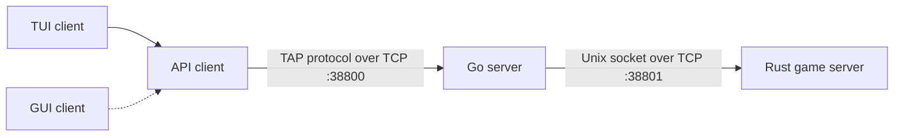
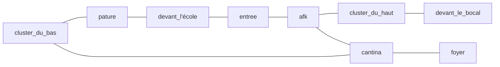

_This project has been created as part of the 42 curriculum by cobussie, nlallema and ldecavel._

## Description

The Answer Protocol (TAP) is a game inspired by
the 70's MUDs (Multi-User Dungeons). The game is set in
our 42 school, with our friends as NPCs, C coding
challenges as the fighting system, and many other elements
inspired by our daily life there.

The project's goal is to implement RFC 42TAP as a real-time, line-oriented
multiplayer protocol while keeping networking, world simulation, and user
interfaces independently maintainable.

The subject requires us to implement a server capable
of accepting clients developed by other students.
However, RFC 42TAP is not detailed enough to guarantee
full interoperability, as it leaves room for custom events,
combat systems, and other implementation choices.
This makes compatibility between our project and other
servers or clients difficult to ensure. We therefore decided
to embrace these differences rather than trying to achieve
a level of interoperability that the protocol itself
does not fully support.

## Documentation

The TAP documentation links to the specifications for the protocol used in
this project.

- [TAP commands](#tap-commands)
- [TAP errors](#tap-errors)
- [TAP events](#tap-events)

The server documentation links to dedicated guides for the
[GO](server/go_server/README.md) and [RUST](server/rust_server/README.md)
implementations. The client documentation links to the dedicated
[TUI](client/tui/README.md) and [GUI](client/gui/README.md) guides.

- [Servers](server/README.md)
- [Clients](client/README.md)

## Architecture



Clients connect only to the Go server. It owns public TAP framing,
authentication, connection limits, chat, groups, and the translation between
TAP frames and the internal JSON protocol. Commands are dispatched through
maps of handlers grouped by domain rather than through one inline connection
loop. World-related handlers route a request to Rust, wait for the correlated
response, and translate it to `OK`, `ERR`, or `EVT` TAP frames.

Go uses a goroutine for each accepted client and a separate event-writing
goroutine for each client. Shared connection, room, and group state is
protected by mutexes. A game-server manager maintains the single outbound TCP
connection to Rust and reconnects it when necessary. This design lets slow or
disconnected clients be isolated from other public sessions.

Rust owns the authoritative world state. One reader thread places internal
JSON frames on an MPSC channel, while a single 10 Hz game loop dispatches
commands, mutates the world, applies timed updates, sends event batches, and
saves state. Its central envelope dispatcher ultimately uses a match-based
command handler inside that loop instead of spawning one handler per command.
Keeping these mutations in one loop avoids concurrent writes to the game state.
C challenges submissions are the exception : each is evaluated on a worker thread and its
result is returned to the game loop through another channel.

The separation was chosen so Go can focus on concurrent network and session
routing while Rust handles deterministic ownership of gameplay state and the
native sandbox.

## Instructions

### Requirements

- Go 1.18 or newer
- Rust toolchain with Cargo and Rust 2024 edition support
- Linux on `x86_64` or `aarch64`
- `/usr/bin/clang`
- `/usr/bin/bwrap`
- `cargo-clippy` and `rustfmt`

## Building and Running

### Build

Build all components :

```bash
make build
```

Build a specific component :

```bash
make build-go-server
make build-rust-server
make build-client-tui
```

The server binaries are created in `server/go_server/go_server` and
`server/rust_server/target/debug/rust_server`.

TODO: specify GUI and TUI targets as well

### Run

The three programs expose runtime address options, using `RUST_SERVER_ARGS`, `GO_SERVER_ARGS` or `CLIENT_ARGS`.

```bash
make run \
  CLIENT_ARGS="--ip 127.0.0.1 --port 38800" \
  GO_SERVER_ARGS="--go-server-port 38800 --rust-server-ip 127.0.0.1 --rust-server-port 38801"
  RUST_SERVER_ARGS="--rust-server-port 38800"
```

The convenience target starts both servers in the background and the TUI in
the foreground :

```bash
make run
```

To run the components separately, run :

```bash
make run-rust-server
```

```bash
make run-go-server
```

```bash
make run-client-tui
```

### Runtime files

`make run` stores PID files and redirected process output under
`/tmp/the_answer_protocol-<uid>` by default. Set `RUN_DIR` to use another
directory. The Rust server also reads world and challenge files and writes
saves relative to `server/rust_server`, while Go creates
`server/go_server/app.log`.

### Make targets

| Target | Purpose |
| --- | --- |
| `make install` | Verify tools and fetch locked Go and Rust dependencies. |
| `make build` | Build every declared component; currently stops at the unavailable GUI target. |
| `make run` | Build and run both servers and the TUI. |
| `make stop` | Stop servers started by `make run`. |
| `make lint` | Run every client and server lint target. |
| `make clean` | Remove Go and Cargo build artifacts. |
| `make build-client-tui` | Build the TUI and its `api-client` dependency. |
| `make build-client-gui` | Build the GUI when a GUI crate exists; currently unavailable. |
| `make run-client-tui` | Build and run the TUI. |
| `make run-client-gui` | Build and run the GUI when a GUI crate exists; currently unavailable. |
| `make lint-client` | Run Clippy and rustfmt checks for the client workspace. |
| `make build-go-server` | Build the Go TAP gateway. |
| `make run-go-server` | Build and run the Go TAP gateway. |
| `make lint-go-server` | Check gofmt and run `go vet` on the Go server. |
| `make build-rust-server` | Build the Rust game server. |
| `make run-rust-server` | Build and run the Rust game server. |
| `make lint-rust-server` | Run Clippy and rustfmt checks on the Rust server. |

## Repository layout

```text
.
├── client/
│   ├── api-client/       shared TAP client library
│   ├── tui/              implemented terminal client
│   ├── gui/              planned GUI documentation
│   └── assets/           TUI manifest and images
├── server/
│   ├── go_server/        public TAP gateway
│   └── rust_server/      world simulation and C sandbox
└── Makefile
```

## Protocol Implementation

The public endpoint follows the course-provided RFC 42TAP dated December 2024:
persistent TCP connections, UTF-8 line-oriented frames, the initial
`OK hello proto=1` greeting, request/response commands, and asynchronous events.
The detailed implemented surface is documented in the sections below.

### Intentional choices and extensions

| Area | RFC 42TAP baseline | Project implementation and rationale                                                                                                                                                              |
| --- | --- |---------------------------------------------------------------------------------------------------------------------------------------------------------------------------------------------------|
| Line endings | Frames end with `LF`; the connection example also uses `CRLF`. | Go emits `LF` and tolerates an optional `CR` before it, allowing both common client styles.                                                                                                       |
| Frame size | A limit of 1,024 bytes is recommended. | Go limits both client input and Rust-server input to 4,096 bytes to accommodate JSON state and encoded C submissions while retaining a hard memory bound.                                         |
| Usernames | UTF-8 handling is required by the RFC security notes. | Usernames are restricted to 3–20 ASCII identifier characters and canonicalized to uppercase. This simplifies collision-free lookup and group/chat routing; ordinary chat and game text remain UTF-8. |
| Internal architecture | The RFC defines only the public client/server protocol. | The server is split behind the public endpoint. Go and Rust exchange one-line JSON over TCP; clients never depend on that private format.                                                         |
| Communication | `GLOBAL`, `ROOM`, and `GROUP` chat scopes are defined. | `CHAT PRIVATE` adds direct messages without changing the existing scopes.                                                                                                                         |
| Groups | `CREATE`, `INVITE`, `JOIN`, and `LEAVE` are defined. | `GROUP QUIT` is accepted as an alias of `GROUP LEAVE`; groups are limited to  players and invitations expire after five minutes.                                                                  |
| Combat | The RFC defines `ATTACK` and leaves advanced mechanics open. | `FIGHT CREATE` and `FIGHT ATTACK` implement collaborative C challenges with dedicated asynchronous events.                                                                                        |
| Events and errors | The RFC defines a minimal standard set. | Connection, backend, movement, resource, death, and fight events plus validation and rate-limit errors expose the state needed by the clients.                                                    |

## Combat System

The project currently exposes two distinct combat paths. Both require a
hostile NPC in the player's room.

### Legacy attack

`ATTACK <npc>` applies exactly one point of damage to the NPC and returns the
RFC-style combat JSON. It does not create a combat instance, allocate turns, or
trigger an immediate NPC counterattack. This path is retained as the basic RFC
command but is separate from the main C-challenge mechanic.

### Code-challenge fights

`FIGHT CREATE <npc>` creates a combat instance for a solo player or, when sent
by a group leader, every group member. Rust selects a random exercise from
`server/rust_server/assets/code` and sends its encoded source, separators, NPC
health, and a 222-second deadline in `EVT FIGHT START`.

Each participant receives one action: submit a solution with `FIGHT ATTACK`.
There is no fixed initiative queue. Submissions are evaluated concurrently and
their effects are applied by the authoritative game loop in the order tester
results arrive. The encounter ends after every participant has a result or
immediately when the NPC dies.

For a successful solution, the base damage is:

```text
base_damage = clamp(npc_hp_at_start / participant_count, 5, u32::MAX)
damage = current_npc_hp if base_damage * 2 > current_npc_hp else base_damage
```

The finishing rule prevents a final turn from leaving a small remainder. A
failed solution causes the NPC to deal a pseudo-random 25–50 damage,
capped by the player's remaining HP. After 222 seconds, each participant who
has not submitted is resolved as a failed action once no evaluation is still
running.

C code is compiled with `/usr/bin/clang` and run through Bubblewrap with
separate namespaces, cleared capabilities and environment, resource limits,
and a seccomp filter. Each compilation stage has an eight-second timeout and
the submitted program has a two-second execution timeout.

Killing an NPC emits `KILL`; it respawns after 30 seconds. A player reduced to
zero HP emits `DEATH`, has the existing save deleted, loses the current
inventory, returns to 100 HP, and respawns in `devant_l'école`. `STATUS`
reports `healthy` at 80% HP or more,
`normal` from 30% to below 80%, and `critical` below 30%.

## Quest System

The Rust server loads quests from `quests.json`. In the current world,
`ndalailallema` in `devant_le_bocal` exposes all of them. `QUEST <npc>` chooses
one randomly from those not already `InProgress` for the player, creates a
quest instance, and returns its description, declared rewards, and state.
`QUESTS` lists the player's stored instances.

The quest data model declares the states `InProgress`, `Completed`, and
`Failed`. Instances are written to the player's TOML save on disconnect or
periodic server save. When a player reconnects, valid unique quest entries are
restored; unknown and duplicate entries are discarded.

## World Design

The world models the 42 campus as nine connected rooms. Players spawn in
`devant_l'école`.



| Room | NPC distribution | Initial items or special role |
| --- | --- | --- |
| `cluster_du_bas` | vquetier, smenard, mdourdoi | Two talkers and one hostile NPC. |
| `pature` | faon | Initial and return location of `objet_perdu`. |
| `devant_l'école` | gagulhon, ayteyssi | Player spawn; two talkers. |
| `devant_le_bocal` | ndalailallema | Talker and active provider of all 13 quests. |
| `cluster_du_haut` | gabach, enchevri, bokim | Two talkers and one hostile NPC. |
| `afk` | acampion, mphippen | One hostile NPC and one talker. |
| `entree` | crappo | Hostile NPC. |
| `cantina` | ldecavel, cobussie | One hostile NPC and one talker. |
| `foyer` | ibady | Hostile NPC. |

There are 16 NPCs. Their configured role flags distinguish hostile mobs from
talking/quest-giving characters. Only `ndalailallema` has a non-empty
quest list and is flagged as a quest-giver.

Four item models exist: `objet_perdu`, `wrap_du_foyer`, `t_shirt_bde`, and
`merci`. Only `objet_perdu` is placed in a room at initial load. Ordinary
dropped items despawn after one minute. When the lost object's despawn timer
fires, it returns to `pature` instead of being removed. The other three models
are not initially distributed.

Rooms, exits, initial inventories, NPCs, dialogues, and quests are data-driven
through JSON. Startup validation rejects unknown exits, invalid item IDs,
unknown NPC spawn rooms, unknown quest references, duplicate quests, and a
missing player spawn room.

## Server Logging

### Go gateway

Go logs use the visible form `HH:MM:SS.ffffff LEVEL message`, with ANSI colors
for `INFO` and `ERROR`. Messages cover connections, disconnections, public
client reads and writes, Rust-server reads and writes, reconnects, command
errors, and rate-limit rejections. Output is written to stdout and to
`app.log`, which is recreated and truncated each time the process starts.

When launched through Make, the Go working directory is `server/go_server`, so
the direct file is `server/go_server/app.log`. Make also redirects stdout to
`/tmp/the_answer_protocol-<uid>/go-server.log`; this second file therefore
contains the same Go log stream, including ANSI escape codes.

### Rust game server

Rust uses `tracing` with local `HH:MM:SS.ffffff` timestamps and an `info`
default filter. It reports startup, connections, parsing and command failures,
world saves, shutdown, and tester activity. Set `RUST_LOG`, for example
`RUST_LOG=debug`, before starting it to include debug command and combat
details. Tracing writes to stderr, while a few lifecycle messages use stdout.
`make run` combines both streams in
`/tmp/the_answer_protocol-<uid>/rust-server.log`.

### Monitoring and abuse detection

Follow both Make-managed server streams with:

```bash
tail -f /tmp/the_answer_protocol-$(id -u)/*-server.log
```

Search the Go log for rejected connections, command floods, and recurring I/O
failures:

```bash
rg 'Connection rejected|Command rate limit exceeded|Read error|Write error' \
  /tmp/the_answer_protocol-$(id -u)/go-server.log
```

The gateway accepts at most 20 simultaneous connections, at most five
connection attempts from one host in ten seconds, and at most ten commands per
client per second. Exceeding the command limit produces
`ERR 429 TOO_MANY_REQUESTS` and closes the connection. Pre-handler connection
rejections are logged but cannot reliably send a TAP frame. Logs are plain
text, have no rotation, and can contain complete client or internal frames;
operators should therefore protect and rotate them outside the application.

## Group Contributions

| Member      | Responsibilities and Contributions                                                                            |
|-------------|--------------------------------------------------------------------------------------------------------------------|
| `ldecavel`  | Go TAP gateway, session and routing behavior, world design, and sandboxed C challenge evaluation.                  |
| `cobussie`  | Rust game server, authoritative simulation, persistence, and combat mechanics.                                     |
| `nlallema`  | Shared Rust `api-client`, asynchronous protocol integration, and the Ratatui terminal client.                      |
| Shared work | Protocol integration, gameplay tuning, testing. |

## Testing

### Existing automated checks

### Multiplayer scenario

Start Rust and Go in separate terminals, then open two TUI instances from
`client/tui` and connect with distinct usernames. Verify that `WHO` reports
both players and that global and private chat reach the correct client. Move
both players into the same room, then verify room chat and presence events.

Have the first player create a group and invite the second. Confirm the invite,
join, and group chat events; then move as the leader and verify that the second
player follows through a `GROUPMOVE` event. Finally, leave or disconnect and
confirm that membership is released for both clients.

For direct wire-level checks, two optional `nc 127.0.0.1 38800` sessions can be
used. Each must receive the greeting before sending `CONNECT <username>`.

### Combat scenario

From the spawn room, move west to `entree` and use `LOOK` to obtain the current
identifier for the hostile NPC `crappo`. Verify that `ATTACK <identifier>`
removes one HP. Then create a code fight through the TUI and submit one correct
and one invalid solution in separate encounters. Check `FIGHT START`,
`FIGHT RESULT`, the damage formula, and `FIGHT END`.

Repeat with a two-player group to confirm that only the leader starts the
encounter, both participants receive the challenge, and damage is divided by
participant count. A participant who does not answer should take 25–50 damage
after 222 seconds. Repeated failures can verify death/reset behavior; killing
the NPC can verify its 30-second respawn.

### Quest scenario

From `devant_l'école`, move west to `entree`, west to `afk`, south to
`cluster_du_haut`, and east to `devant_le_bocal`. Use `LOOK` to obtain
`ndalailallema`'s identifier, then issue `QUEST <identifier>` and `QUESTS` over
raw TAP. Verify assignment, prevention of the same active quest being assigned
twice, save/reconnect restoration, and the documented `name` payload.

TODO: quest progression

## Resources

- Course-provided **RFC 42TAP**, “The Answer Protocol: A TCP-Based Multi-User
  Dungeon Communication Protocol,” December 2024 — public protocol baseline.
- [RFC 2119](https://www.rfc-editor.org/rfc/rfc2119) — interpretation of
  requirement keywords such as MUST, SHOULD, and MAY.
- [RFC 5234](https://www.rfc-editor.org/rfc/rfc5234) — ABNF notation used for
  TAP frame grammar.
- [RFC 9293](https://www.rfc-editor.org/rfc/rfc9293) and
  [RFC 3629](https://www.rfc-editor.org/rfc/rfc3629) — TCP and UTF-8 references.
- [Go `net` package](https://pkg.go.dev/net) and
  [Rust `std::net`](https://doc.rust-lang.org/std/net/) — networking APIs used
  by the two servers.
- [Ratatui](https://ratatui.rs/) and
  [Crossterm](https://docs.rs/crossterm/) — terminal rendering and input used
  by the TUI.
- [Bubblewrap](https://github.com/containers/bubblewrap) and the
  [Clang user manual](https://clang.llvm.org/docs/UsersManual.html) — isolation
  and compilation references for code-challenge evaluation.

### AI assistance

AI was used throughout the project to produce and refine our documentation,
help us read and understand the documentation for the tools we used, and
support us while learning new programming languages. For the first time, we
also used AI to generate limited code snippets. Both the generated code and
the documentation were carefully reviewed, corrected, and adapted by the team
before being integrated into the project.

Our goal was to use AI as a design and reasoning assistant, bringing our work
closer to that of a software architect who understands systems, makes technical
decisions, and reviews integrations, rather than merely producing lines of
code. The team remained responsible for every architectural choice and for the
final validation of both code and documentation.

---

## TAP commands

This section describes the public, line-oriented protocol exposed by the Go
server. It reflects the current Go command handlers, the Rust game-server
responses, and the typed commands available in `api-client`.

### Transport and framing

TAP is a UTF-8 protocol over TCP. Each command and response occupies one line.
The Go server accepts `LF` and trims an optional preceding `CR`; it always writes
`LF`.

```abnf
command-line  = command-name [SP arguments] [CR] LF
command-name  = 1*ALPHA
arguments     = 1*(VCHAR / SP / utf8-nonascii)

success-line  = "OK" [SP response-data] LF
response-data = 1*(VCHAR / SP / utf8-nonascii)
utf8-nonascii = <a valid non-ASCII UTF-8 sequence>
```

Client frames, including the line ending, are limited to 4,096 bytes. A client
should keep at most one command awaiting an `OK` or `ERR` response on a
connection, while continuing to process any interleaved `EVT` frames.

Top-level command names are case-sensitive and must be uppercase. Group and
fight subcommands, and chat scopes, are normalized by the Go server. Movement
directions are interpreted by Rust and must be `NORTH`, `SOUTH`, `EAST`, or
`WEST`.

### Handshake and authentication

Immediately after accepting a TCP connection, the Go server sends:

```text
OK hello proto=1
```

Protocol version 1 is the only version accepted end to end by the current
`api-client`. The client then has 30 seconds to authenticate with `CONNECT`.

A username:

- contains between 3 and 20 ASCII characters;
- starts with an ASCII letter;
- contains only ASCII letters, digits, `_`, or `-` after the first character.

The Go server canonicalizes accepted usernames to uppercase.

### Common failures

All commands are subject to syntax, authentication, rate-limit, and connection
errors. In particular:

```text
ERR 400 EMPTY_COMMAND
ERR 400 COMMAND_NOT_FOUND
ERR 400 INVALID_ARGUMENTS
ERR 400 NOT_CONNECTED
ERR 429 TOO_MANY_REQUESTS
ERR 900 CONNECTION_FAILED
ERR 902 GAME_SERVER_TIMEOUT
ERR 999 UNKNOWN_ERROR
```

`TOO_MANY_REQUESTS` is sent after more than ten commands in one second and is
followed by connection closure. `CONNECTION_FAILED` and
`GAME_SERVER_TIMEOUT` apply only when a command or routing decision needs the
Rust server. The complete catalog is in the TAP errors section below.

### Core commands

**CONNECT**

```text
CONNECT <username>
```

```text
OK connected
```

`CONNECT` authenticates the Go session and registers the player with Rust when
the game server is available. A missing Rust server does not prevent Go-side
authentication; the client then receives `EVT GAME SERVER DISCONNECTED`.

Command-specific failures include `INVALID_USERNAME`, `NAME_IN_USE`,
`ALREADY_CONNECTED`, and `ROOM_FULL`.

**LOOK**

```text
LOOK
```

```text
OK <room-state-json>
```

Example payload:

```json
{
  "room": {
    "id": "2.devant_l'école",
    "name": "Devant l'école",
    "description": "Un grand panneau 42 vous accueille à la meilleure école du numérique.",
    "exits": {
      "WEST": "Entree",
      "SOUTH": "Pature"
    }
  },
  "players": ["ALICE", "BOB"],
  "items": ["0.objet_perdu"],
  "npcs": ["4.gagulhon", "11.ayteyssi"]
}
```

The `id` and resource values are protocol representations. Display names and
exit destinations are formatted by Rust. Command-specific failures include
`PLAYER_NOT_FOUND` and `ROOM_NOT_FOUND`.

**MOVE**

```text
MOVE <NORTH|SOUTH|EAST|WEST>
```

```text
OK room=<room-identifier>
```

If the player belongs to a group, only the leader may send `MOVE`; Rust moves
the other group members with the leader and emits `GROUPMOVE` events to them.
Command-specific failures include `NO_EXIT`, `NOT_GROUP_LEADER`,
`PLAYER_NOT_FOUND`, and `PLAYER_ALREADY_IN_COMBAT`.

**WHO**

```text
WHO
```

```text
OK players=<count>
```

The count is the number of players authenticated on this Go server. It does not
require the Rust server.

**QUIT**

```text
QUIT
```

```text
OK bye
```

After sending the response, Go closes the connection, releases group state,
notifies other clients, and sends a best-effort internal `QUIT` to Rust.

### Chat commands

**Global chat**

```text
CHAT GLOBAL <message>
```

The sender receives `OK`. Every other authenticated client receives:

```text
EVT GLOBAL CHAT <username> <message>
```

**Room chat**

```text
CHAT ROOM <message>
```

The sender receives `OK`. Go asks Rust for the players in the sender's room and
routes the event to those players:

```text
EVT ROOM CHAT <username> <message>
```

This command requires a working Go-to-Rust connection.

**Group chat**

```text
CHAT GROUP <message>
```

The sender receives `OK`. Other group members receive:

```text
EVT GROUP CHAT <username> <message>
```

The sender receives `NOT_IN_GROUP` when no group is active.

**Private chat**

```text
CHAT PRIVATE <username> <message>
```

The sender receives `OK`. The named recipient receives:

```text
EVT PRIVATE CHAT <sender> <message>
```

An unknown recipient returns `NO_SUCH_USER`.

All chat messages must contain at least one non-whitespace character. An unknown
scope returns `INVALID_SCOPE`.

### Group commands

Groups are maintained by the Go server. A group contains at most three players,
and invitations expire after five minutes.

**GROUP CREATE**

```text
GROUP CREATE
```

```text
OK group=<group-id>
```

The authenticated player becomes the group leader. An existing membership
returns `ALREADY_IN_GROUP`.

**GROUP INVITE**

```text
GROUP INVITE <username>
```

```text
OK
```

When the Rust server is connected, the inviter and target must be in the same
game room. The target receives `EVT GROUP INVITE <leader>`. Possible failures
include `NOT_IN_GROUP`, `NO_SUCH_USER`, `ALREADY_IN_GROUP`, `GROUP_FULL`,
`GROUP_NOT_FOUND`, and `NOT_IN_SAME_ROOM`.

During a Rust outage, the current handler still returns `OK` and sends the
invite event, but does not record the invitation. The recipient cannot use that
notice to join a group.

**GROUP JOIN**

```text
GROUP JOIN <leader-or-member-username>
```

```text
OK group=<group-id>
```

The argument may name any connected member of the invited group. Joining
requires a valid invitation and, when Rust is connected, the same game room.
Existing members receive `EVT GROUP JOIN <username>`. Possible failures include
`NO_SUCH_USER`, `ALREADY_IN_GROUP`, `NOT_INVITED`, `GROUP_FULL`,
`GROUP_NOT_FOUND`, and `NOT_IN_SAME_ROOM`.

`GROUP JOIN` must not be attempted while Rust is disconnected. The current Go
handler skips group assignment and then dereferences the missing membership,
which can terminate the Go process.

**GROUP LEAVE**

```text
GROUP LEAVE
```

```text
OK
```

`GROUP QUIT` is accepted as an untyped alias with the same behavior.
If the leader leaves, Go dissolves the group. Other members receive
`EVT GROUP LEAVE <username>`. A player without a group receives `NOT_IN_GROUP`.

### Resource and NPC commands

An item or NPC can normally be addressed by its `<numeric-id>.<name>` protocol
representation. Rust also accepts a unique exact name in the relevant room or
inventory.

**TAKE**

```text
TAKE <item-identifier>
```

```text
OK taken=<item-name>
```

Other players in the room receive `EVT TAKE <username> <item-identifier>`.
Rust returns the item's model name, such as `objet_perdu`, rather than its
numeric protocol representation. Failures include `ITEM_NOT_FOUND` and
`PLAYER_NOT_FOUND`.

**DROP**

```text
DROP <item-identifier>
```

```text
OK dropped=<submitted-item-reference>
```

Other players in the room receive `EVT DROP <username> <item-identifier>`.
Failures include `ITEM_NOT_IN_INVENTORY` and `PLAYER_NOT_FOUND`. Rust may use
its shared numeric `404` code while resolving the item; Go maps every `DROP`
error with that code to `ITEM_NOT_IN_INVENTORY`.

**INVENTORY**

```text
INVENTORY
```

```text
OK ["0.objet_perdu","2.t_shirt_bde"]
```

The response data is a JSON array of item protocol representations.

**TALK**

```text
TALK <npc-identifier>
```

```text
OK <dialogue-text>
```

The response advances that player's dialogue with the NPC. Rust uses
`[end of dialogue]` to mark the end of a dialogue sequence. Failures include
`NPC_NOT_FOUND` and `PLAYER_NOT_FOUND`. Although Go defines an
`NPC_NOT_IN_ROOM` mapping for `TALK`, the current Rust handler folds a room
mismatch into `NPC_NOT_FOUND`.

**ATTACK**

```text
ATTACK <npc-identifier>
```

```text
OK <combat-result-json>
```

```json
{
  "attacker_hp": 100,
  "target_hp": 149,
  "damage": 1,
  "status": "combat"
}
```

This is the legacy direct-damage command, separate from the code-challenge
`FIGHT` flow. Failures include `NPC_NOT_FOUND`, `NPC_NOT_IN_ROOM`,
`NPC_NOT_HOSTILE`, and `NPC_IN_COMBAT`. If the player is already in a
code-challenge fight, Rust returns code `410`; Go does not map that code for
`ATTACK`, so the TAP response is `UNKNOWN_ERROR`.

**STATUS**

```text
STATUS
```

```text
OK <player-status-json>
```

```json
{
  "hp": 80,
  "max_hp": 100,
  "status": "healthy"
}
```

The status is `healthy` at 80% HP or above, `normal` at 30% or above but below
80%, and `critical` below 30%.

### Quest commands

**QUEST**

```text
QUEST <npc-identifier>
```

```text
OK <quest-json>
```

```json
{
  "name": "Kaizen",
  "description": "Réussissez une fois l'épreuve is_sorted_ascending.c en moins de 55 secondes.",
  "reward": [
    {
      "qty": 3,
      "chance": 100,
      "type": "MERCI"
    }
  ],
  "status": "in progress"
}
```

If the player belongs to a group, Go permits only the leader and sends a grouped
internal `QUEST`. A non-leader receives `NOT_GROUP_LEADER` before anything
is forwarded.

**QUESTS**

```text
QUESTS
```

```text
OK [<quest-json>,...]
```

The response is a JSON array using the same quest object shape as `QUEST`.
`[]` is valid when the player has no active quest.

### Code-challenge fight commands

**FIGHT CREATE**

```text
FIGHT CREATE <npc-identifier>
```

```text
OK FIGHT CREATED
```

The NPC must be a hostile NPC in the player's room and must not already be in a
combat instance. A group leader creates one combat instance for the group;
non-leaders receive `NOT_GROUP_LEADER`. Rust sends each participant an
`EVT FIGHT START` payload containing the source code, separators, time limit,
and NPC health.

Failures include `NPC_NOT_FOUND`, `NPC_NOT_IN_ROOM`, `NPC_NOT_HOSTILE`,
`NPC_IN_COMBAT`, `PLAYER_ALREADY_IN_COMBAT`, and `FILE_NOT_FOUND`.

**FIGHT ATTACK**

```text
FIGHT ATTACK <encoded-code>
```

```text
OK Processing
```

`encoded-code` is a single-line source submission. Clients must replace spaces
and newlines with the `sp_sep` and `nl_sep` values received in `EVT FIGHT START`.
Evaluation is asynchronous; results arrive through `EVT FIGHT RESULT`, followed
eventually by `EVT FIGHT END`.

Failures include `PLAYER_NOT_FOUND` and `PLAYER_NOT_IN_COMBAT`. Rust also emits
code `409` for a duplicate action.

### USE command

`USE` activates the effect associated with an item in the player's inventory.

```text
USE <item-identifier>
```

```text
OK <item-use-result>
```

Items can be addressed by their `<numeric-id>.<name>` protocol representation
or by an unambiguous exact name. The Go server validates the TAP request and
forwards it to Rust, which checks the player's inventory, applies the behavior
associated with the selected item, and returns the result through the public
TAP response. Invalid identifiers and items that are not present in the
player's inventory return the corresponding TAP error.

## TAP errors

This section describes the error frames that the Go TAP server can send to a
client. The catalog is derived from the Go error response definitions and the
error codes returned by the Rust game server.

### Frame format

Errors use the same UTF-8, line-oriented transport described above. Every error ends with `LF` on the wire.

```abnf
error-line    = "ERR" SP error-code SP error-name LF
error-code    = 3DIGIT
error-name    = 1*(ALPHA / DIGIT / "_")
```

Example:

```text
ERR 404 NPC_NOT_FOUND
```

Codes are not unique identifiers by themselves. Several error names share a
code, so clients should retain both the numeric code and the symbolic name.

### Protocol errors

| Code | Error name | Meaning |
| --- | --- | --- |
| `201` | `NAME_IN_USE` | The requested username is already authenticated on the Go server. |
| `204` | `NO_CONTENT` | The Rust server returned no usable command data. This code is defined and routed globally, but is not emitted by a current command handler. |
| `301` | `NO_EXIT` | The direction is invalid or the current room has no exit in that direction. |
| `400` | `ALREADY_CONNECTED` | The client sent `CONNECT` after it was already authenticated. |
| `400` | `NOT_CONNECTED` | The command requires an authenticated TAP session. |
| `400` | `INVALID_USERNAME` | The username violates the TAP username rules. |
| `400` | `ROOM_FULL` | The Go server already has its maximum number of authenticated clients. |
| `400` | `GROUP_FULL` | The target group already contains three players. |
| `400` | `EMPTY_COMMAND` | The client sent an empty command line. |
| `400` | `COMMAND_NOT_FOUND` | The top-level command or group/fight subcommand is unknown. |
| `400` | `INVALID_ARGUMENTS` | Arguments are missing, unexpected, or contain invalid surrounding whitespace. |
| `400` | `INVALID_SCOPE` | The `CHAT` scope is not `GLOBAL`, `ROOM`, `GROUP`, or `PRIVATE`. |
| `401` | `NOT_IN_GROUP` | The requested operation requires group membership. |
| `402` | `ALREADY_IN_GROUP` | The player or invitation target already belongs to a group. |
| `403` | `NO_SUCH_USER` | The requested user is not authenticated on the Go server. |
| `403` | `NOT_INVITED` | The player has no current invitation to the target group. Invitations expire after five minutes. |
| `403` | `NOT_GROUP_LEADER` | Only the group leader may perform the requested grouped action. |
| `404` | `ITEM_NOT_FOUND` | The item identifier cannot be resolved in the current room. |
| `404` | `ITEM_NOT_IN_INVENTORY` | The item is not in the player's inventory. |
| `404` | `NPC_NOT_FOUND` | The NPC identifier cannot be resolved. |
| `404` | `GROUP_NOT_FOUND` | The referenced group no longer exists. |
| `404` | `NO_SUCH_GROUP` | A requested group cannot be found. This name is defined for routed game-server errors. |
| `405` | `PLAYER_NOT_FOUND` | The Rust game server does not know the player. |
| `405` | `NPC_NOT_HOSTILE` | The selected NPC cannot be attacked. |
| `406` | `NO_QUEST_AVAILABLE` | The NPC has no quest currently available to the player. |
| `407` | `NPC_NOT_IN_ROOM` | The selected NPC is not in the player's room. |
| `407` | `NOT_IN_SAME_ROOM` | A group invitation or join target is not in the same room. |
| `408` | `NPC_IN_COMBAT` | The NPC already belongs to another combat instance. |
| `409` | `ACTION_ALREADY_TAKEN` | The player already submitted an action for the current combat round. This name is defined, but the current `FIGHT ATTACK` map exposes that Rust error as `UNKNOWN_ERROR`. |
| `410` | `PLAYER_ALREADY_IN_COMBAT` | The command is unavailable while the player is in a combat instance, or a new combat was requested for a player already fighting. Go maps it for `MOVE` and `FIGHT CREATE`; on other forwarded commands the same Rust code becomes `UNKNOWN_ERROR`. |
| `411` | `PLAYER_NOT_IN_COMBAT` | `FIGHT ATTACK` was sent without an active combat instance. |
| `412` | `FILE_NOT_FOUND` | The Rust server could not load the challenge source file for a fight. |
| `413` | `ROOM_NOT_FOUND` | The Rust server cannot resolve the player's current room. |
| `429` | `TOO_MANY_REQUESTS` | More than ten commands were received within one second. The Go server sends this error and then closes the client connection. |
| `900` | `CONNECTION_FAILED` | The Rust game server is unavailable or a Go handler failed while communicating with it. |
| `901` | `SEND_FAILED` | A command could not be transmitted between the servers. This mapping is defined, but no current Rust command handler emits it. |
| `902` | `GAME_SERVER_TIMEOUT` | The Rust server did not answer a forwarded command within three seconds. |
| `997` | `INVALID_GROUP_COMMAND` | Reserved for a rejected internal grouped-command envelope. The current Rust validation path does not emit it. |
| `998` | `INVALID_QUESTION` | Reserved for a rejected internal question envelope. The current Rust validation path does not emit it. |
| `999` | `INVALID_COMMAND` | The Rust server rejected an internal command envelope or invalid JSON. |
| `999` | `UNKNOWN_ERROR` | The Go server received an unmapped, invalid, or unexpected game-server error code. |

### Where errors originate

The Go server generates session and syntax errors directly, including
`INVALID_USERNAME`, `NOT_CONNECTED`, group errors, rate limiting, and failures
to reach the Rust server.

The Rust server returns numeric error codes inside its internal JSON response.
The Go server maps the code through the command-specific response table before
it sends a TAP error. If the code is not valid for the pending command, the
client receives `ERR 999 UNKNOWN_ERROR`.

The following failures close the TCP connection instead of guaranteeing a TAP
error frame:

- a frame larger than 4,096 bytes;
- a client read timeout;
- a socket read or write failure;
- failure to authenticate within 30 seconds;
- rejection before the TAP client handler starts because the connection or
  per-host connection-attempt limit was reached.

### Client-side errors

The Rust `api-client` also exposes local `NetworkError`, `ProtocolError`, and
`InternalError` values. These are client-library failures, not `ERR` frames, and
therefore are not assigned TAP error codes.

## TAP events

TAP events are unsolicited server-to-client frames. They may arrive between a
command request and its response. A client must route `EVT` frames separately
and keep waiting for the corresponding `OK` or `ERR` frame.

### Frame format

Events use the same UTF-8, line-oriented transport described above. Every event ends with `LF` on the wire.

```abnf
event-line = "EVT" SP event-content LF
event-content = 1*(VCHAR / SP / utf8-nonascii)
utf8-nonascii = <a valid non-ASCII UTF-8 sequence>
```

The Go formatter builds an event in this order:

```text
EVT <event_name> [<emitted_by>] [<data>]
```

`event_name` may contain spaces, and `emitted_by` is optional. The concrete
forms below are the authoritative way to split an event.

### Session and server events

| Frame | Meaning |
| --- | --- |
| `EVT CONNECT <username>` | Another player authenticated. The newly connected player does not receive its own event. |
| `EVT QUIT <username>` | An authenticated player disconnected or sent `QUIT`. |
| `EVT STATS players=<count>` | The number of authenticated players changed. |
| `EVT GAME SERVER CONNECTED` | The Go server connected or reconnected to the Rust game server. |
| `EVT GAME SERVER DISCONNECTED` | The Rust game-server connection is unavailable. |

### Chat events

| Frame | Delivery |
| --- | --- |
| `EVT GLOBAL CHAT <username> <message>` | Every other authenticated TAP client. |
| `EVT ROOM CHAT <username> <message>` | Other players reported by Rust as being in the sender's room. |
| `EVT GROUP CHAT <username> <message>` | Other members of the sender's Go-side group. |
| `EVT PRIVATE CHAT <username> <message>` | Only the named recipient of `CHAT PRIVATE`. |

Messages are non-empty, single-line UTF-8 text. Spaces are preserved after the
sender field.

### Group and movement events

| Frame | Meaning |
| --- | --- |
| `EVT GROUP INVITE <leader>` | The recipient was invited to the leader's group. |
| `EVT GROUP JOIN <username>` | A player joined the recipient's group. |
| `EVT GROUP LEAVE <username>` | A player left the group, disconnected, or caused the group to be dissolved. |
| `EVT GROUPMOVE <leader> <direction>` | A non-leader group member was moved with the leader. |
| `EVT ROOM <username> PRESENCE ENTER` | The player entered the recipient's room. |
| `EVT ROOM <username> PRESENCE LEAVE` | The player left the recipient's room. |

The current room presence order is `ROOM`, username, then `PRESENCE` and the
action. This differs from RFC 42TAP but is the order emitted by the Go formatter
and parsed by `api-client`.

### World and resource events

| Frame | Meaning |
| --- | --- |
| `EVT TAKE <username> <item-identifier>` | Another player took an item from the room. |
| `EVT DROP <username> <item-identifier>` | Another player dropped an item in the room. |
| `EVT SPAWN type=ITEM id=<item-identifier>` | An item spawned in the current room. |
| `EVT SPAWN type=NPC id=<npc-identifier>` | An NPC respawned in the current room. |
| `EVT DESPAWN type=ITEM id=<item-identifier>` | A dropped item despawned from the current room. |
| `EVT KILL <username> <npc-identifier>` | The named player killed an NPC. |
| `EVT DEATH <username> respawn_room_id=<room-name>` | A player died and was reset to the spawn room. |

Item, NPC, and room identifiers are the representations produced by the Rust
server, normally `<numeric-id>.<name>` for resources and rooms.

### Fight events

**Fight start**

```text
EVT FIGHT START <fight-start-json>
```

```json
{
  "code": "int<SP>answer(void)<SP>{<NL>...<NL>}",
  "time": 222,
  "nl_sep": "<NL>",
  "sp_sep": "<SP>",
  "npc_id": "12.ldecavel",
  "npc_hp": 150,
  "npc_max_hp": 150
}
```

The event is delivered to every player in the newly created combat instance.
`code` uses the separators supplied by `nl_sep` and `sp_sep` so the payload
remains on one TAP line.

**Fight result**

```text
EVT FIGHT RESULT <fight-result-json>
```

```json
{
  "player_name": "ALICE",
  "success": true,
  "damage_dealt": 50
}
```

The result is delivered to the players in the combat instance after a code
submission has been evaluated.

**Fight end**

```text
EVT FIGHT END
```

This event indicates that the combat instance has finished and was removed.

### JSON event data

When event data is a structured Go value, the Go server serializes it as compact
JSON. When Rust supplies JSON as a string, the string is forwarded verbatim
after the event name. JSON event payloads therefore remain on a single line and
must not contain a literal `LF`.

An event not matching one of the concrete forms is exposed by `api-client` as
`ServerEvent::Unknown` rather than being treated as a command response.

## Thanks

Special thanks to all our friends who make our time at 42 such a memorable
adventure and who agreed to appear in the game as NPCs. Their personalities,
stories, and humor helped bring this world to life and made the project far
more enjoyable to create and play.  

`vquetier`, `faon`, `smenard`, `mdourdoi`,
`gagulhon`, `gabach`, `enchevri`, `acampion`, `mphippen`, `crappo`, `ayteyssi`,
`ibady`, and `bokim`.
