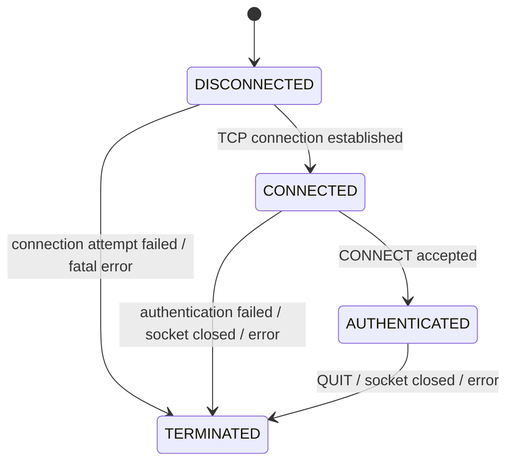

# CLIENT MODEL

## User State (Client Side)

### As Graph



### As C Code

```c
typedef enum e_client_state
{
    DISCONNECTED,
    CONNECTED,
    AUTHENTICATED,
    TERMINATED
}   t_client_state;
```
