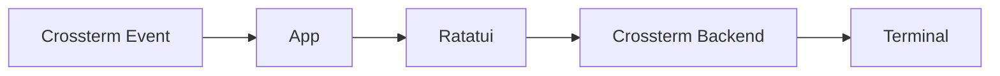
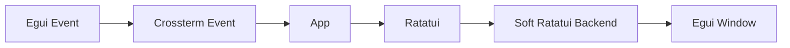

The client workspace provides [terminal](tui/README.md) and [graphical](gui/README.md) entry points to the same
game. Both use one Rust [application core](client-core), the same Ratatui views and widgets,
and the same [asynchronous TAP library](client-api/README.md). The frontends differ only at the event
and rendering boundaries.

## Components

- [Client API](client-api/README.md) documents connection setup, typed
  requests, responses, events, configuration, and errors.
- [`client-core`](client-core) owns the shared application, state, networking,
  assets, components, and Ratatui renderer.
- [TUI](tui/README.md) documents the Crossterm event loop, terminal lifecycle,
  controls, commands, and Ratatui rendering.
- [GUI](gui/README.md) documents Egui-to-Crossterm event translation, the
  software Ratatui backend, desktop rendering, and controls.

The public frames shared with the servers are specified in the root
[TAP protocol reference](../PROTOCOL.md).

## Shared application model

The `client-core` crate owns `App`, network integration, screen states, focus,
actions, overlays, and all Ratatui drawing code. Each frontend supplies
compatible device events and a Ratatui backend.

### Terminal pipeline



### Graphical pipeline



There is no pseudo-terminal between the GUI and the application. Egui input is
translated directly into Crossterm-compatible events; Ratatui renders into an
in-memory character grid; Egui then paints that grid in its native window.

## Shared assets

`client/assets/manifest.json` associates server identifiers with presentation
metadata:

- NPC display names, roles, contextual actions, and sprites;
- item display names, descriptions, and sprites;
- room illustrations and navigation orientation;

Static images use `image_path`. Animated NPCs use an ordered `image_paths`
array and `frame_ms`. The referenced files live below
`client/assets/pictures`.

Assets only affect presentation. The server remains authoritative for rooms,
inventories, NPC state, quests, groups, fights, and every gameplay mutation.
They are embedded in both client binaries by default. Passing
`--assets <directory>` loads `manifest.json` and the referenced images from an
external directory instead.

## Requirements

- Rust toolchain with Cargo and Rust 2024 edition support
- A Crossterm-compatible terminal for the TUI
- A supported native desktop environment for Eframe/Egui
- A [TAP gateway](../server/go_server/README.md), normally at `127.0.0.1:38800`

## Build and run

From the repository root:

```bash
make install
make build-client-tui
make build-client-gui
```

Launch either frontend:

```bash
make run-client-tui
make run-client-gui
```

Both clients share the `--ip`, `--port`, and `--assets` options through
`CLIENT_ARGS`:

```bash
make run-client-tui CLIENT_ARGS="--ip 192.0.2.10 --port 38800"
make run-client-gui CLIENT_ARGS="--ip 192.0.2.10 --port 38800 --assets ./assets"
```

Both connect to `127.0.0.1:38800` and use their embedded assets by default.

Run client-wide formatting and static analysis with:

```bash
make lint-client
```

Build details, runtime behavior, and controls are documented by the component
READMEs linked above.
