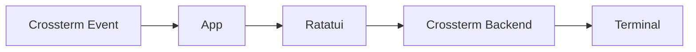
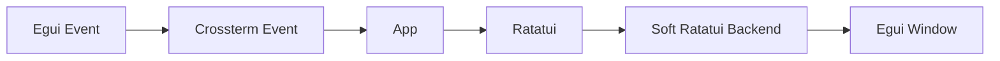

The client workspace provides [terminal](tui/README.md) and [graphical](gui/README.md) entry points to the same
game. Both use one Rust [application core](client-core), the same Ratatui views and widgets,
and the same [asynchronous TAP library](client-api/README.md). The frontends differ only at the event
and rendering boundaries.

## Components

- [Client API](client-api/README.md) documents connection setup, typed
  requests, responses, events, configuration, and errors.
- [`client-core`](client-core) owns the shared application, state, networking,
  assets, components, and Ratatui renderer.
- [TUI](tui/README.md) documents the Crossterm event loop, terminal lifecycle,
  controls, commands, and Ratatui rendering.
- [GUI](gui/README.md) documents Egui-to-Crossterm event translation, the
  software Ratatui backend, desktop rendering, and controls.

The public frames shared with the servers are specified in the root
[TAP protocol reference](../PROTOCOL.md).

## Shared application model

The `client-core` crate owns `App`, network integration, screen states, focus,
actions, overlays, and all Ratatui drawing code. Each frontend supplies
compatible device events and a Ratatui backend.

### Terminal pipeline



### Graphical pipeline



There is no pseudo-terminal between the GUI and the application. Egui input is
translated directly into Crossterm-compatible events; Ratatui renders into an
in-memory character grid; Egui then paints that grid in its native window.

## Request chains

Both frontends submit `RequestChain` values to the shared network manager.
Each chain occupies one entry in the bounded command queue and is processed
before the next chain. Requests still execute sequentially: each command waits
for its response before the following command is sent. Responses are delivered
individually to the application, and asynchronous server events remain active.

A movement is queued as `[MOVE, LOOK]`. Two successful movements therefore run
as `MOVE -> response -> LOOK -> response -> MOVE -> response -> LOOK -> response`.
Keeping the refresh in the original chain prevents another queued movement from
being inserted between its `MOVE` and `LOOK` under latency.

A server command error or local request failure stops the current chain and
discards its unsent requests. Already completed commands are not rolled back,
and other queued chains are not discarded. Initial state loading uses
`[WHO, STATUS, INVENTORY, QUESTS, LOOK]`; the player's death refresh uses
`[LOOK, STATUS]`. A full command queue rejects the new chain and displays a
warning.

## Latency indicator

The shared command input displays a red `LAG` block when the rolling average
of the last three completed request timings reaches at least 1,000 ms. Until
three measurements are available, the average uses the available samples.
The indicator disappears when that average falls below the threshold.

Measurements cover request execution and response-event delivery, including
failed requests, but exclude time waiting in the application command queue.
The indicator updates after each request completes; it is shared by the TUI
and GUI.

## Group and quest updates

Both frontends remove invitations on `GROUP INVITE <leader> REMOVED`. A
`GROUP LEAVE` event from the leader clears local group state and displays a
disbanding notification. Quest-step and completion events update the quest
panel and display notifications; completion data includes the awarded items.

## Shared assets

`client/assets/manifest.json` associates server identifiers with presentation
metadata:

- NPC display names, roles, contextual actions, and sprites;
- item display names, descriptions, and sprites;
- room illustrations and navigation orientation;

Static images use `image_path`. Animated NPCs use an ordered `image_paths`
array and `frame_ms`. The referenced files live below
`client/assets/pictures`.

Assets only affect presentation. The server remains authoritative for rooms,
inventories, NPC state, quests, groups, fights, and every gameplay mutation.
They are embedded in both client binaries by default. Passing
`--assets <directory>` loads `manifest.json` and the referenced images from an
external directory instead.

## Requirements

- Rust toolchain with Cargo and Rust 2024 edition support
- A Crossterm-compatible terminal for the TUI
- A supported native desktop environment for Eframe/Egui
- A [TAP gateway](../server/go_server/README.md), normally at `127.0.0.1:38800`

## Build and run

From the repository root:

```bash
make install
make build-client-tui
make build-client-gui
```

Launch either frontend:

```bash
make run-client-tui
make run-client-gui
```

Both clients share the `--ip`, `--port`, and `--assets` options through
`CLIENT_ARGS`:

```bash
make run-client-tui CLIENT_ARGS="--ip 192.0.2.10 --port 38800"
make run-client-gui CLIENT_ARGS="--ip 192.0.2.10 --port 38800 --assets ./assets"
```

Both connect to `127.0.0.1:38800` and use their embedded assets by default.

Run client-wide formatting and static analysis with:

```bash
make lint-client
```

Build details, runtime behavior, and controls are documented by the component
READMEs linked above.
