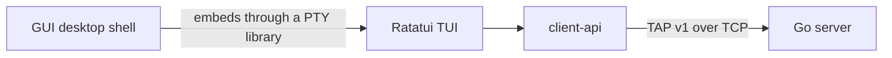

The client side of The Answer Protocol offers two ways to enter the same shared
world : a native terminal interface and a contemporary graphical interface. Both
preserve the command-driven identity of a MUD and rely on the same Rust client
stack.

## Architecture



The TUI is the canonical game interface. It owns the interactive views,
keyboard and mouse controls, local presentation state, and MUD-style command
flow. It can run directly in a compatible terminal.

The GUI hosts that TUI through a pseudo-terminal integration library. It adds a
modern desktop frame while keeping the same terminal rendering, interaction
model, and game experience. Embedding the existing interface also avoids
maintaining a second set of screens or a second protocol implementation.

The shared `client-api` crate owns all communication with the Go server :
connection setup, the TAP v1 handshake, command encoding, response parsing,
asynchronous event decoding, errors, and connection lifecycle.

| Component | Responsibility | Documentation |
| --- | --- | --- |
| `gui` | Desktop application that embeds and presents the TUI. | [GUI README](gui/README.md) |
| `tui` | Ratatui game interface and direct terminal client. | [TUI README](tui/README.md) |
| `client-api` | Reusable asynchronous TAP client library. | This document |
| `assets` | Shared manifest, names, images, and presentation metadata. | This document |

The server remains authoritative for world state. Both client entry points
therefore expose the same rooms, players, NPCs, items, quests, groups, chats,
and code-combat encounters.

## Shared assets

The `client/assets` directory contains the presentation resources shared by
the TUI and the GUI. Its `manifest.json` associates the protocol identifiers
sent by the server with client-side display metadata:

- NPC display names, roles, available contextual actions, and static or
  animated sprites;
- item display names, descriptions, and sprites;
- room illustrations and the orientation used by the navigation view;
- quest descriptions displayed by the interfaces.

Static images use `image_path`. Animated NPCs use an ordered `image_paths`
array together with `frame_ms`, which defines the duration of each frame. The
referenced image files are stored below `client/assets/pictures`.

These resources affect presentation only. Rooms, inventories, NPC state,
quests, combat, and every other gameplay value remain authoritative on the
server; a client asset never creates or changes a world entity.

## Requirements

- a Rust toolchain with Cargo and Rust 2024 edition support;
- a terminal supported by Crossterm for direct TUI execution;
- pseudo-terminal and desktop display support for the GUI;
- a running TAP stack, normally exposed by the Go server on
  `127.0.0.1:38800`.

The root Makefile is the supported entry point for installing dependencies,
building, running, and linting the clients.

## Build and run

Run every command in this section from the repository root.

Install the project dependencies and verify the required tools:

```bash
make install
```

Build either client independently:

```bash
make build-client-tui
make build-client-gui
```

With the Go and Rust servers running, launch the desired interface:

```bash
make run-client-tui
make run-client-gui
```

Both clients connect to `127.0.0.1:38800` by default. Forward another address
through `CLIENT_ARGS` when required:

```bash
make run-client-tui CLIENT_ARGS="--ip 192.0.2.10 --port 38800"
make run-client-gui CLIENT_ARGS="--ip 192.0.2.10 --port 38800"
```

Check formatting and Clippy diagnostics across the client workspace with:

```bash
make lint-client
```

## Shared `client-api`

`client-api` provides a typed asynchronous API over TAP. Applications use Rust
requests, responses, and events rather than parsing raw protocol frames.

### Connection model

`Client::connect` performs these steps:

1. connect to the requested TCP address;
2. wait for `OK hello proto=<version>`;
3. require protocol version 1;
4. start one background bridge task;
5. return the client and a broadcast receiver for server events.

The bridge serializes command requests, so only one command is pending on the
wire at a time. `EVT` frames are published without consuming the pending `OK`
or `ERR` response.

### Minimal example

Add the local crate to another client package:

```toml
[dependencies]
client-api = { path = "../client-api" }
tokio = { version = "1", features = ["full"] }
```

```rust
use client_api::Client;

#[tokio::main]
async fn main() -> Result<(), Box<dyn std::error::Error>> {
    let (mut client, mut events) = Client::connect("127.0.0.1:38800").await?;

    tokio::spawn(async move {
        while let Ok(event) = events.recv().await {
            println!("event: {event:?}");
        }
    });

    client.login("ALICE".to_string()).await??;
    let room = client.look().await??;
    println!("room: {}", room.room.name);

    client.quit().await;
    Ok(())
}
```

Command methods return a nested result:

- the outer `Result<_, TapError>` reports network, protocol, or internal bridge
  failures;
- the inner `Result<_, CommandError>` reports an `ERR` response returned by the
  server.

### Command surface

Convenience methods cover login, exploration, chat, connected players, groups,
resources, player status, NPC interaction, quests, and disconnection.

The generic `execute_request(ApiRequest)` interface additionally exposes the
code-fight commands and is used by the TUI. Its request types cover:

```text
Connect, Quit, Look, Move, Who
FightCreate, FightAttack
GlobalChat, PrivateChat
Take, Drop, Inventory, Status, Talk, Attack, Quest, Quests
GroupCreate, GroupJoin, GroupLeave, GroupInvite
```

See the root [TAP command reference](../README.md#tap-commands) for the complete
wire syntax and server behavior.

### Configuration

`Client::connect_with` accepts a `ClientConfig`.

| Setting | Default | Purpose |
| --- | --- | --- |
| `connect_timeout` | 5 seconds | TCP connection deadline. |
| `handshake_timeout` | 2 seconds | TAP greeting deadline. |
| `request_timeout` | 10 seconds | Per-command response deadline. |
| `close_timeout` | 2 seconds | Grace period for bridge shutdown. |
| `max_frame_length` | 65,536 bytes | Maximum frame accepted by the client codec. |
| `command_channel_capacity` | 2,048 | Queued command requests. |
| `event_channel_capacity` | 2,048 | Broadcast event backlog. |

The public Go server accepts TAP frames up to 4,096 bytes. Client commands must
remain within that server-side limit even though the client codec can decode
larger frames.

### Errors

| Type | Meaning |
| --- | --- |
| `CommandError` | Parsed TAP `ERR`, with an optional numeric code and display message. |
| `NetworkError` | Connection, codec, timeout, or unexpected disconnection failure. |
| `ProtocolError` | Invalid opcode, malformed arguments, unsupported protocol version, or parse failure. |
| `InternalError` | The background bridge can no longer receive or complete requests. |
| `TapError` | Top-level wrapper for network, protocol, and internal errors. |

The complete server error catalog is available in the root
[TAP error reference](../README.md#tap-errors).

### Events

`Client::subscribe` creates additional receivers for the same asynchronous
event stream. Recognized `ServerEvent` values cover sessions, game-server
availability, presence, chats, groups, world resources, death and kills,
statistics, and fight lifecycle. A syntactically valid event without a
specialized representation is retained as `ServerEvent::Unknown`.

See the root [TAP event reference](../README.md#tap-events) for every public
event frame.
