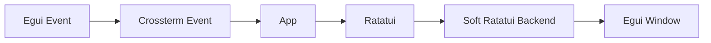

The `gui` crate provides the native graphical interface for The Answer
Protocol. It reuses `client_core::App`, including its screens, state,
networking, focus model, commands, and widgets. Eframe owns the native window
and its GPU surface; the application rasterises every pixel it displays,
including room photographs and animated character sprites.

Public command behavior and server frames are defined in the root
[TAP protocol reference](../../PROTOCOL.md). The transport layer is documented
in the [Client API README](../client-api/README.md).

## A graphical application, not a terminal

This client does not use `curses`, `ncurses`, or any terminal emulation. It
never allocates a pseudo-terminal and never emits ANSI escape sequences. It does not draw inside the terminal that launches it: it opens
its own window.

What actually runs:

- `eframe` and `winit` own a native operating-system window, titled
  `The Answer Protocol`, whose minimum size the application declares itself.
- `wgpu` owns a GPU surface. Every frame is rasterised by the application into
  an in-memory pixmap and uploaded as a texture.
- The application supplies its own font. Glyphs come from bitmap atlases
  compiled into the binary, so the application decides how text is drawn. A
  terminal application cannot: the font belongs to the terminal emulator and is
  chosen by the user.

The fixed 9-by-18 character grid is a layout system the application chose and
rasterises itself, the way a tile-based game chooses a tile size. It is not
inherited from a terminal. Ratatui is used here as a layout library rather than
a terminal library, which is what lets the GUI and the
[TUI](../tui/README.md) share a single `client-core`.

| | GUI | TUI |
| --- | --- | --- |
| Display surface | Eframe window on a `wgpu` GPU surface | A real terminal |
| Pixels | Rasterized by the application | Drawn by the terminal emulator |
| Fonts | Bitmap atlases embedded in the binary | The terminal's own font |
| Shared logic | `client-core` | `client-core` |

## Rendering pipeline



The GUI does not start or embed a terminal process. Instead:

1. Egui keyboard, text, pointer, and wheel input is translated into Crossterm
   events.
2. Those events are passed directly to the shared `App`.
3. The app draws its existing widgets with Ratatui.
4. `soft_ratatui` renders the Ratatui cells into an in-memory grid.
5. `egui_ratatui` displays that grid inside the Eframe window.

This preserves identical client behavior across the GUI and [TUI](../tui/README.md) without a
pseudo-terminal or a second set of screens.

## Requirements

- Rust toolchain with Cargo and Rust 2024 edition support
- A native desktop environment supported by Eframe
- A [TAP gateway](../../server/go_server/README.md), normally on `127.0.0.1:38800`

## Build and run

From the repository root:

```bash
make build-client-gui
make run-client-gui
```

The native window is titled `The Answer Protocol` and connects to the default
gateway at `127.0.0.1:38800`.

Shared flags and defaults are listed in the
[client workspace instructions](../README.md#build-and-run).

Example with another endpoint and an external asset directory:

```bash
make run-client-gui CLIENT_ARGS="--ip 192.0.2.10 --port 38800 --assets ./assets"
```

The GUI crate uses these frontend dependencies:

| Crate | Responsibility |
| --- | --- |
| `eframe` / `egui` | Native application lifecycle, window, and input. |
| `client-core` | Shared `App`, state, events, views, widgets, and assets. |
| `ratatui` | Backend-independent terminal UI drawing. |
| `soft_ratatui` | In-memory character-cell renderer and font atlases. |
| `egui_ratatui` | Egui widget that paints the software terminal. |
| `crossterm` | Common event representation consumed by `App`. |
| `tokio` | Runtime used by the shared asynchronous application. |

## Runtime behavior

`GuiApp` owns four long-lived values:

- the shared `client_core::App`;
- a software `ratatui::Terminal`;
- the active Tokio runtime handle;
- the current Egui-to-terminal cell grid.

On each Eframe logic pass, the GUI enters the Tokio runtime, converts pending
Egui input, drains application events, updates the shared app, draws a new
Ratatui frame, and schedules the next repaint after the standard 33 ms tick.
When `App` requests shutdown, the GUI closes the native viewport.

The software terminal starts at 120 columns by 40 rows and uses 9-by-18 regular
and bold monospace atlases. The native window cannot shrink below the 80-by-24
application minimum. Cells with an unset background or foreground receive the
default colors `#231129` and `#E6E1EA` before display. The drawable area is also
clamped to the graphics texture limit.

## Input translation

The input adapter converts these Egui events:

| Egui input | Crossterm representation |
| --- | --- |
| Text input | One `KeyCode::Char` event per character. |
| Arrow keys | `Up`, `Down`, `Left`, and `Right`. |
| `Enter`, `Escape`, `Backspace` | Matching Crossterm key codes. |
| `PageUp`, `PageDown`, `F1` | Matching Crossterm key codes. |
| `Tab` / `Shift+Tab` | `Tab` / `BackTab`. |
| `Ctrl` plus a letter | Control-modified character event. |
| Copy request | `Ctrl+C`. |
| Primary pointer press | Left-button event at the corresponding cell. |
| Pointer movement | `Moved` event at the corresponding cell. |
| Mouse wheel | `ScrollUp` or `ScrollDown` at the pointed cell. |

Ctrl, Alt, and Shift modifiers are preserved. Pointer coordinates are mapped
from Egui pixels to Ratatui column and row coordinates using the active cell
size and displayed grid rectangle. Wheel events modified with Ctrl remain
available to Egui for native zoom behavior.

## Shared application

The GUI uses the core's [keyboard and mouse controls](../client-core/README.md#keyboard-and-mouse-controls)
and [command input](../client-core/README.md#command-input). Its
[views](../client-core/README.md#views-and-components),
[request chains](../client-core/README.md#request-chains),
[latency indicator](../client-core/README.md#latency-indicator), and
[fight editor](../client-core/README.md#fight-editor) are documented there.

## Logging

The frontend writes to `gui.log` using the core's
[logging setup](../client-core/README.md#notifications-and-logging). For example:

```bash
RUST_LOG=info make run-client-gui
```

## Source layout

| File | Responsibility |
| --- | --- |
| `src/main.rs` | Tokio runtime and native Eframe startup. |
| `src/app.rs` | Shared-app ownership and Eframe update/draw integration. |
| `src/input.rs` | Egui-to-Crossterm keyboard and pointer conversion. |
| `src/screen.rs` | Software terminal, cell grid, fonts, and Egui sizing. |

## Linting

Formatting and static analysis are documented in the
[client workspace instructions](../README.md#linting).
