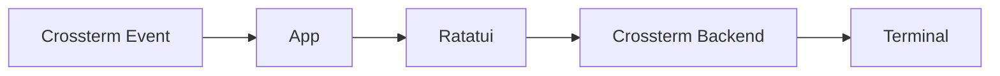

The `tui` crate provides the complete terminal interface for The Answer
Protocol. It is a binary frontend around `client_core::App`: `client-core`
owns the application state, network integration, views, widgets, overlays,
focus system, and MUD-style command input. Crossterm supplies native terminal
events and Ratatui renders through its Crossterm backend.

Public command behavior and server frames are defined in the root
[TAP protocol reference](../../PROTOCOL.md). The transport API used by the
application is documented in the [Client API README](../client-api/README.md).

## Rendering pipeline



The application accepts Crossterm keyboard and mouse events, mutates its
central state, draws Ratatui widgets, and flushes the resulting cells to the
terminal through `CrosstermBackend`.

The shared `App` and drawing code live in `client-core`; the `tui` crate owns
only the terminal lifecycle, Crossterm event stream, and terminal rendering
loop.

## Requirements

- Rust toolchain with Cargo and Rust 2024 edition support
- A terminal supported by Crossterm
- A [TAP gateway](../../server/go_server/README.md), normally available at `127.0.0.1:38800`

## Build and run

From the repository root:

```bash
make build-client-tui
make run-client-tui
```

Shared flags and defaults are listed in the
[client workspace instructions](../README.md#build-and-run).

Example with another endpoint:

```bash
make run-client-tui CLIENT_ARGS="--ip 192.0.2.10 --port 38800"
```

## Terminal lifecycle

At startup, the binary:

1. installs a panic hook that restores terminal state;
2. enables raw mode;
3. enters the alternate screen;
4. enables mouse capture;
5. creates `Terminal<CrosstermBackend<Stdout>>`;
6. runs the shared application asynchronously.

The frontend waits with `tokio::select!` for either a Crossterm device event or
an application event from `client-core`. The shared event broker produces the
33 ms UI tick and carries network, API, request, and fight-timeout events on a
bounded Tokio channel. Normal shutdown restores the cursor, disables mouse
capture, leaves the alternate screen, and disables raw mode.

## Shared application

The [Client core README](../client-core/README.md) owns the shared behavior:

- [Application and connection lifecycle](../client-core/README.md#connection-lifecycle)
- [Request chains](../client-core/README.md#request-chains) and
  [latency indicator](../client-core/README.md#latency-indicator)
- [Keyboard and mouse controls](../client-core/README.md#keyboard-and-mouse-controls)
- [Command input](../client-core/README.md#command-input)
- [Views and components](../client-core/README.md#views-and-components)
- [Fight editor](../client-core/README.md#fight-editor)

## Source layout

| File | Responsibility |
| --- | --- |
| `src/main.rs` | Shared CLI parsing, asset selection, logging, and process lifecycle. |
| `src/app.rs` | Crossterm setup, device-event stream, application loop, drawing, and restoration. |

Application state, networking, events, components, views, assets, and errors
are implemented by the sibling `client-core` crate.

## Logging

The frontend writes to `tui.log` using the core's
[logging setup](../client-core/README.md#notifications-and-logging). For example:

```bash
RUST_LOG=info make run-client-tui
```

## Validation

```bash
cargo test --manifest-path client/tui/Cargo.toml
cargo clippy --manifest-path client/tui/Cargo.toml --all-targets -- -D warnings
```
