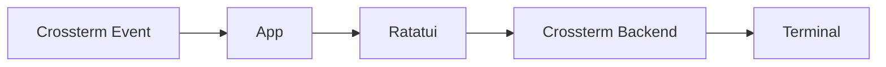

The `tui` crate provides the complete terminal interface for The Answer
Protocol. It is a binary frontend around `client_core::App`: `client-core`
owns the application state, network integration, views, widgets, overlays,
focus system, and MUD-style command input. Crossterm supplies native terminal
events and Ratatui renders through its Crossterm backend.

Public command behavior and server frames are defined in the root
[TAP protocol reference](../../PROTOCOL.md). The transport API used by the
application is documented in the [Client API README](../client-api/README.md).

## Rendering pipeline



The application accepts Crossterm keyboard and mouse events, mutates its
central state, draws Ratatui widgets, and flushes the resulting cells to the
terminal through `CrosstermBackend`.

The shared `App` and drawing code live in `client-core`; the `tui` crate owns
only the terminal lifecycle, Crossterm event stream, and terminal rendering
loop.

## Requirements

- Rust toolchain with Cargo and Rust 2024 edition support
- A terminal supported by Crossterm
- A [TAP gateway](../../server/go_server/README.md), normally available at `127.0.0.1:38800`

## Build and run

From the repository root:

```bash
make build-client-tui
make run-client-tui
```

| Flag | Default | Purpose |
| --- | --- | --- |
| `--ip` | `127.0.0.1` | Go TAP server IP address or hostname. |
| `--port` | `38800` | Public TAP server port. |
| `--assets` | Embedded assets | Optional directory containing `manifest.json` and pictures. |

Example with another endpoint:

```bash
make run-client-tui CLIENT_ARGS="--ip 192.0.2.10 --port 38800"
```

## Terminal lifecycle

At startup, the binary:

1. installs a panic hook that restores terminal state;
2. enables raw mode;
3. enters the alternate screen;
4. enables mouse capture;
5. creates `Terminal<CrosstermBackend<Stdout>>`;
6. runs the shared application asynchronously.

The frontend waits with `tokio::select!` for either a Crossterm device event or
an application event from `client-core`. The shared event broker produces the
33 ms UI tick and carries network, API, request, and fight-timeout events on a
bounded Tokio channel. Normal shutdown restores the cursor, disables mouse
capture, leaves the alternate screen, and disables raw mode.

## Application lifecycle

The login view collects a player name, opens the TAP connection, and sends
`CONNECT`. After authentication, the application loads `WHO`, `STATUS`,
`INVENTORY`, `QUESTS`, and `LOOK` through the network manager.

Network, game, and presentation state are kept separate. Typed API responses
and asynchronous server events update the central state before the next draw.
A successful movement automatically requests `LOOK` so the room view stays
synchronized with the authoritative server.

## Keyboard and mouse controls

| Input | Action |
| --- | --- |
| `Ctrl+C` | Quit the application. |
| `Ctrl+H` | Toggle help. |
| `Ctrl+E` | Toggle the event and trace overlay. |
| `F1` | Toggle the chat overlay. |
| `Tab` / `Shift+Tab` | Cycle focus across interactive panels. |
| Arrow keys on navigation | Move north, south, west, or east. |
| Arrow keys in lists | Change selection or scroll. |
| `Enter` | Submit input, activate an action, or advance dialogue. |
| `Esc` | Close the active popup or modal. |
| Left mouse button | Focus, select, or dismiss supported elements. |
| `Ctrl+S` in the fight editor | Submit the encoded C solution. |

Focus cycles through command input, NPCs, room items, quests, action history,
inventory, and the contextual right panel.

## Text commands

The parser accepts full TAP-like phrases and compact aliases without case
sensitivity:

| Input | Request |
| --- | --- |
| `connect <name>` | `CONNECT <name>` |
| `quit` | `QUIT` |
| `look` | `LOOK` |
| `move <direction>` | `MOVE <direction>` |
| `who` | `WHO` |
| `chat global <message>` / `say <message>` | `CHAT GLOBAL` |
| `chat room <message>` / `cr <message>` | `CHAT ROOM` |
| `chat group <message>` / `cg <message>` | `CHAT GROUP` |
| `chat private <name> <message>` / `msg ...` | `CHAT PRIVATE` |
| `take <item>` | `TAKE` |
| `drop <item>` | `DROP` |
| `inventory` / `inv` | `INVENTORY` |
| `status` | `STATUS` |
| `talk <npc>` | `TALK` |
| `attack <npc>` | `ATTACK` |
| `quest <npc>` | `QUEST` |
| `quests` | `QUESTS` |
| `group create` / `gc` | `GROUP CREATE` |
| `group invite <name>` / `gi <name>` | `GROUP INVITE` |
| `group join <name>` / `gj <name>` | `GROUP JOIN` |
| `group leave` / `gl` | `GROUP LEAVE` |
| `fight create <npc>` / `fc <npc>` | `FIGHT CREATE` |
| `fight attack <code>` / `fa <code>` | `FIGHT ATTACK` |

Contextual panels expose the same operations without requiring command entry,
including take, drop, talk, quest, direct attack, and code-fight actions.

## Source layout

| File | Responsibility |
| --- | --- |
| `src/main.rs` | Shared CLI parsing, asset selection, logging, and process lifecycle. |
| `src/app.rs` | Crossterm setup, device-event stream, application loop, drawing, and restoration. |

Application state, networking, events, components, views, assets, and errors
are implemented by the sibling `client-core` crate.

## Logging

The client appends structured tracing records to `tui.log`. The default filter
is `debug`; override it with `RUST_LOG`:

```bash
RUST_LOG=info make run-client-tui
```

## Validation

```bash
cargo test --manifest-path client/tui/Cargo.toml
cargo clippy --manifest-path client/tui/Cargo.toml --all-targets -- -D warnings
```
