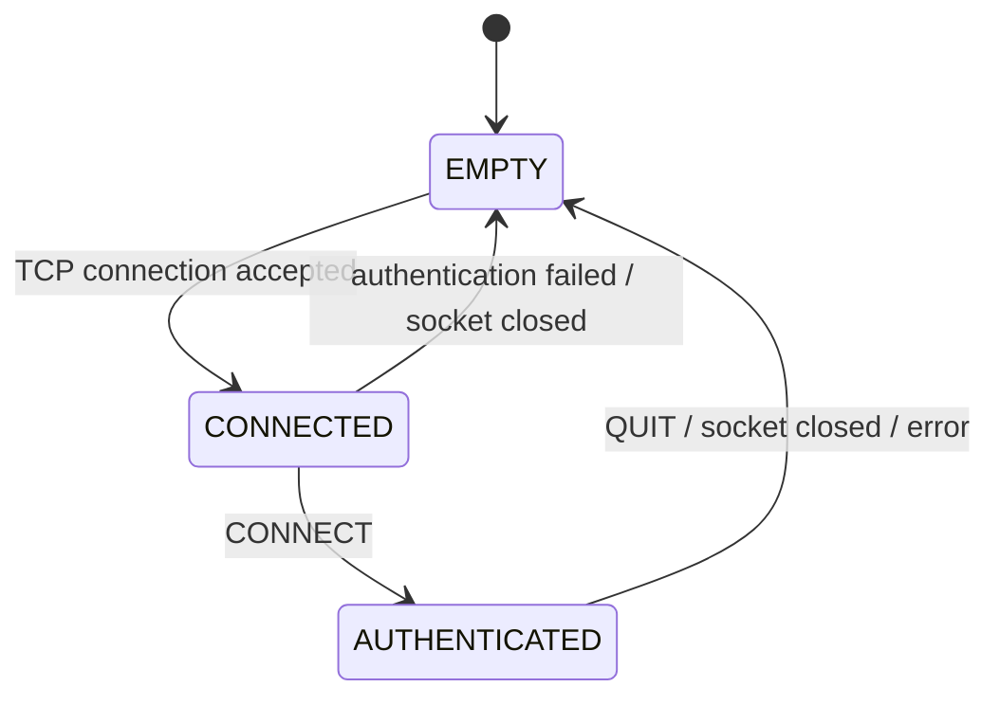

### ROOM MODEL


```c
typedef enum e_state
{
    EMPTY,
    CONNECTED,
    AUTHENTICATED
}   t_state;
```

```txt
[ROOM]
00 CONNECTED
01 AUTHENTIFICATED as BOB
02 EMPTY
03 EMPTY
04 EMPTY
05 EMPTY
06 EMPTY
07 EMPTY
08 EMPTY
09 EMPTY
10 EMPTY
11 EMPTY
12 EMPTY
13 EMPTY
14 EMPTY
15 EMPTY
16 EMPTY
17 EMPTY
18 EMPTY
19 EMPTY
```
