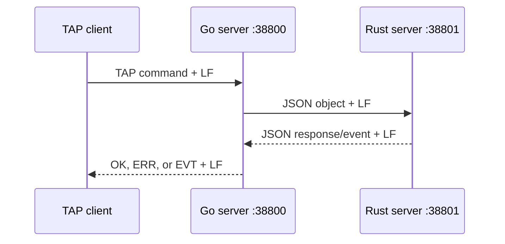

The server side is split into two processes:

- [Go server](go_server/README.md): public TAP endpoint, authentication,
  sessions, chat, groups, routing, and protocol translation;
- [Rust server](rust_server/README.md): game world, rooms, items, NPCs, quests,
  persistence, combat, and C challenge evaluation.

This document is the source of truth for communication between them.

## Topology



The Rust server listens on `0.0.0.0:38801` and accepts one Go connection. The
Go server listens for TAP clients on port `38800` by default and maintains one
outbound Rust connection.

Both directions use UTF-8, newline-delimited frames. JSON must be encoded on a
single line. The Go side limits incoming frames from Rust to 4,096 bytes and
uses a five-second socket write timeout.

## Go to Rust envelopes

The Go server sends one of three JSON object shapes.

### Single-player command

```json
{
  "player": "ALICE",
  "command": "MOVE",
  "data": "NORTH"
}
```

| Field | Type | Meaning |
| --- | --- | --- |
| `player` | string | Canonical uppercase player name. |
| `command` | string | Internal uppercase command name. |
| `data` | string | Command argument or an empty string. |

### Grouped command

```json
{
  "leader": "ALICE",
  "grouped_players": ["BOB", "CHARLIE"],
  "command": "MOVE",
  "data": "NORTH"
}
```

The leader is not repeated in `grouped_players`. Rust currently implements
grouped `MOVE` and `FIGHT_CREATE`. Go also sends grouped `QUEST`, but Rust has no
grouped `QUEST` handler, so that path currently times out and must not be
treated as supported.

### Question

```json
{
  "question": "ROOM_PLAYERS",
  "data": "ALICE",
  "id": "c94d8d2b-..."
}
```

`id` is a correlation identifier generated by Go. The only current question is
`ROOM_PLAYERS`; `data` contains the player whose room should be queried. Go uses
this question for room chat and same-room group checks.

## Rust to Go envelopes

Rust can send command responses, question answers, targeted event batches, or
a plain acknowledgement.

### Command response

```json
{
  "player": "ALICE",
  "command": "MOVE",
  "error_code": 0,
  "data": "6.entree"
}
```

Go routes the object to the pending command channel for `player`. A zero
`error_code` is successful. Non-zero codes are converted to command-specific
TAP errors; unmapped codes become `ERR 999 UNKNOWN_ERROR`.

### Question answer

```json
{
  "question": "ROOM_PLAYERS",
  "data": "[\"ALICE\",\"BOB\"]",
  "id": "c94d8d2b-..."
}
```

The answer repeats the question and correlation `id`. `data` is a string; for
`ROOM_PLAYERS`, that string contains a JSON array of player names. Go waits up
to five seconds for a matching answer.

### Targeted event batch

```json
{
  "player": "ALICE",
  "events": [
    {
      "emitted_by": "BOB",
      "event_name": "ROOM",
      "data": "PRESENCE ENTER"
    }
  ]
}
```

`player` selects one authenticated Go client. Each event requires a non-empty
`event_name`; `emitted_by` and `data` may be absent or empty. Go formats the
example as:

```text
EVT ROOM BOB PRESENCE ENTER
```

Go accepts either one event-batch object or a JSON array of event-batch objects.
Rust currently emits one object per target player at the end of a tick. The
Go-side model also supports `ignored_players` for broadcasts created locally:

```json
{
  "ignored_players": ["ALICE"],
  "events": [
    {
      "emitted_by": "ALICE",
      "event_name": "CONNECT",
      "data": null
    }
  ]
}
```

### Plain acknowledgement

```text
Duly noted.
```

Rust returns this for internal `CONNECT` and `QUIT`. Go intentionally ignores
it because those operations do not wait for a game response.

## Internal command matrix

| Internal command | Envelope | Rust result data | Go waits for a response |
| --- | --- | --- | --- |
| `CONNECT` | Single | `Duly noted.` | No |
| `LOOK` | Single | Room-state JSON string | Yes |
| `MOVE` | Single or grouped | Destination room representation | Yes |
| `QUIT` | Single | `Duly noted.` | No |
| `TAKE` | Single | Canonical item representation | Yes |
| `DROP` | Single | Requested item representation | Yes |
| `INVENTORY` | Single | JSON array string | Yes |
| `TALK` | Single | Dialogue text | Yes |
| `ATTACK` | Single | Combat-result JSON string | Yes |
| `STATUS` | Single | Player-status JSON string | Yes |
| `QUEST` | Single | Quest JSON string | Yes |
| `QUESTS` | Single | Quest-array JSON string | Yes |
| `FIGHT_CREATE` | Single or grouped | `FIGHT CREATED` | Yes |
| `FIGHT_ATTACK` | Single | `Processing` | Yes |
| `GROUP LEAVE` | Single | No Rust handler; normally an empty line | No |
| `USE` | Single | No Rust handler; normally an empty line | Yes, then times out |

`CHAT`, `WHO`, and normal group management are Go-side TAP operations and are
not game commands. `CHAT ROOM`, `GROUP INVITE`, and `GROUP JOIN` may send the
`ROOM_PLAYERS` question.

Rust applies its in-combat guard before normal or grouped command dispatch. An
otherwise unknown command such as `GROUP LEAVE`, `USE`, or grouped `QUEST` can
therefore return code `410` instead of an empty line when the player or leader
is already fighting. Go maps `410` only for `MOVE` and `FIGHT_CREATE`; other
pending commands expose it as `UNKNOWN_ERROR`. A fire-and-forget `GROUP LEAVE`
response is not consumed by that handler and can remain in the player's command
queue.

## Shared payloads

### Room state

```json
{
  "room": {
    "id": "2.devant_l_ecole",
    "name": "Devant l'école",
    "description": "A room description.",
    "exits": {
      "WEST": "Entree",
      "SOUTH": "Pature"
    }
  },
  "players": ["ALICE", "BOB"],
  "items": ["0.objet_perdu"],
  "npcs": ["4.gagulhon"]
}
```

### Inventory

```json
["0.objet_perdu", "2.t_shirt"]
```

### Player status

```json
{
  "hp": 80,
  "max_hp": 100,
  "status": "healthy"
}
```

### Direct combat result

```json
{
  "attacker_hp": 100,
  "target_hp": 149,
  "damage": 1,
  "status": "combat"
}
```

### Quest

```json
{
  "name": "Tunnel",
  "description": "Complete the requested objective.",
  "reward": [
    {
      "qty": 1,
      "chance": 100,
      "type": "MERCI"
    }
  ],
  "status": "in progress"
}
```

## Routing and timing

The Go reader classifies each non-acknowledgement Rust frame in this order:

1. list of event batches;
2. one event batch;
3. question answer;
4. command response.

Invalid or unrecognized frames are logged and ignored. Command handlers wait up
to three seconds for Rust. Questions wait up to five seconds.

If Rust disconnects, Go broadcasts `EVT GAME SERVER DISCONNECTED`, clears the
connection, and retries every five seconds. After reconnecting, Go sends an
internal `CONNECT` for every authenticated player, then broadcasts
`EVT GAME SERVER CONNECTED`. The current Rust process accepts only one Go
connection and exits when that connection's reader channel closes, so a real
reconnect normally requires restarting Rust.

## Error propagation

Rust error codes are numeric and carry no symbolic name internally. Go maps
them using the pending command before producing the public TAP error. The
authoritative public error catalog is the root [TAP errors](../README.md#tap-errors)
section.

Transport failures while a TAP command is running are exposed as
`CONNECTION_FAILED`; a missing command response becomes `GAME_SERVER_TIMEOUT`.
Fire-and-forget operations such as `CONNECT`, `QUIT`, and the Go-side group
leave cleanup do not consume a Rust command response.
