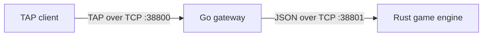

# Servers

The server side of The Answer Protocol is split into two cooperating
processes. The split gives concurrent public networking and authoritative game
simulation independent execution models.



## Components

- [Go server](go_server/README.md) documents the public endpoint,
  authentication, sessions, rate limits, chat, groups, command routing,
  logging, and internal protocol translation.
- [Rust server](rust_server/README.md) documents world loading, the game loop,
  rooms, resources, NPCs, quests, persistence, combat, sandboxing, and the
  internal messages it accepts and emits.

The public commands and frames shared with clients are specified separately in
the root [TAP protocol reference](../PROTOCOL.md).

## Process boundary

The Go gateway listens on port `38800` by default. It accepts multiple TAP
clients and maintains one outbound connection to the Rust engine. The Rust
engine listens on port `38801` by default and accepts that gateway connection.

Internal messages are UTF-8 JSON objects delimited by `LF`. They fall into four
categories:

- single-player commands;
- grouped commands;
- correlated room questions and answers;
- targeted batches of world events.

Go translates public TAP input into the appropriate internal message and maps
the Rust result back to an `OK`, `ERR`, or `EVT` frame. Rust remains the only
authority for world mutations. Chat and group membership are owned by Go;
operations that depend on location query Rust before being applied.

## Build and run

From the repository root:

```bash
make build-go-server
make build-rust-server

make run-rust-server
make run-go-server
```

Or start the whole stack with:

```bash
make run
```

Detailed configuration, runtime behavior, and validation commands are in the
two component READMEs linked above.
